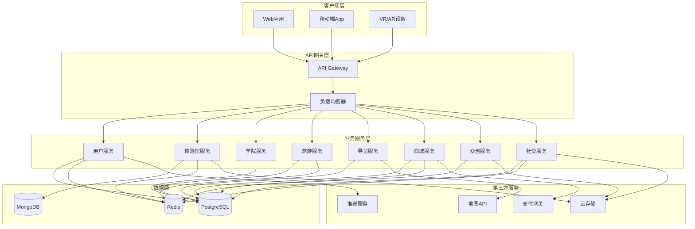

# 设计文档

## 概述

冀忆红途平台采用现代化的微服务架构，结合前后端分离的设计模式，构建一个高性能、可扩展的红色文化数字生态系统。

### 技术栈方案

#### 方案一：全栈JavaScript生态（推荐 - 开发效率高）

**适用场景**: 快速开发、团队技术栈统一、前后端代码复用

- **前端**: 
  - React 18 + TypeScript
  - Three.js (3D渲染) + React Three Fiber
  - A-Frame (VR/AR体验)
  - Ant Design / Material-UI (UI组件库)
  - Redux Toolkit (状态管理)
  
- **后端**: 
  - Node.js 18+ + Express.js
  - TypeScript
  - Prisma ORM (数据库访问)
  - Socket.io (实时通信)
  
- **数据库**: 
  - PostgreSQL 14+ (主数据库)
  - MongoDB 6+ (文档存储)
  - Redis 7+ (缓存和会话)
  
- **部署**: 
  - Docker + Kubernetes
  - Nginx (反向代理)
  - PM2 (进程管理)

**优势**: 
- 前后端使用同一语言，降低学习成本
- npm生态丰富，第三方库众多
- 开发效率高，适合快速迭代
- TypeScript提供类型安全

**劣势**: 
- Node.js单线程，CPU密集型任务性能较弱
- 需要额外处理并发和异步逻辑

---

#### 方案二：Java企业级方案（推荐 - 稳定性高）

**适用场景**: 大型企业项目、高并发场景、长期维护

- **前端**: 
  - Vue 3 + TypeScript
  - Three.js + TresJS
  - Element Plus (UI组件库)
  - Pinia (状态管理)
  - Vite (构建工具)
  
- **后端**: 
  - Spring Boot 3.x
  - Spring Cloud (微服务框架)
  - MyBatis Plus (ORM)
  - Spring Security (安全框架)
  
- **数据库**: 
  - MySQL 8.0+ / PostgreSQL 14+
  - MongoDB 6+
  - Redis 7+
  - Elasticsearch (搜索引擎)
  
- **部署**: 
  - Docker + Kubernetes
  - Nacos (服务注册与配置)
  - Sentinel (流量控制)

**优势**: 
- 成熟的企业级框架，稳定性高
- 强大的并发处理能力
- 完善的生态和社区支持
- 适合大型团队协作

**劣势**: 
- 开发周期相对较长
- 学习曲线较陡
- 部署包体积较大

---

#### 方案三：Python AI增强方案（推荐 - AI能力强）

**适用场景**: 需要AI推荐、数据分析、机器学习能力

- **前端**: 
  - Next.js 14 (React框架)
  - TypeScript
  - Three.js + React Three Fiber
  - Tailwind CSS (样式框架)
  - SWR (数据获取)
  
- **后端**: 
  - FastAPI (高性能异步框架)
  - Python 3.11+
  - SQLAlchemy (ORM)
  - Celery (异步任务队列)
  
- **AI/ML**: 
  - TensorFlow / PyTorch (深度学习)
  - Scikit-learn (机器学习)
  - Pandas + NumPy (数据处理)
  
- **数据库**: 
  - PostgreSQL 14+ (主数据库)
  - MongoDB 6+ (文档存储)
  - Redis 7+ (缓存)
  - Milvus (向量数据库，用于推荐)
  
- **部署**: 
  - Docker + Kubernetes
  - Gunicorn + Uvicorn (ASGI服务器)

**优势**: 
- 强大的AI和数据分析能力
- FastAPI性能优秀，开发效率高
- 适合智能推荐和个性化功能
- Python生态丰富

**劣势**: 
- 前后端语言不统一
- Python运行效率相对较低
- 需要额外的异步编程知识

---

#### 方案四：Go微服务方案（推荐 - 性能最优）

**适用场景**: 高性能要求、大规模并发、云原生架构

- **前端**: 
  - Vue 3 + TypeScript
  - Three.js
  - Naive UI (UI组件库)
  - Pinia (状态管理)
  
- **后端**: 
  - Go 1.21+
  - Gin / Fiber (Web框架)
  - GORM (ORM)
  - gRPC (服务间通信)
  
- **数据库**: 
  - PostgreSQL 14+
  - MongoDB 6+
  - Redis 7+
  - ETCD (服务发现)
  
- **部署**: 
  - Docker + Kubernetes
  - Istio (服务网格)
  - Prometheus + Grafana (监控)

**优势**: 
- 极高的性能和并发能力
- 编译型语言，部署简单
- 天然支持并发（goroutine）
- 云原生生态完善

**劣势**: 
- 学习曲线较陡
- 生态相对较新
- 开发效率略低于动态语言

---

### 通用技术组件（所有方案共用）

- **地图服务**: 高德地图API / 百度地图API
- **支付**: 微信支付 + 支付宝
- **云存储**: 阿里云OSS / 腾讯云COS / 七牛云
- **CDN**: 阿里云CDN / 腾讯云CDN
- **推送服务**: 极光推送 / 阿里云移动推送
- **短信服务**: 阿里云短信 / 腾讯云短信
- **监控**: Prometheus + Grafana / 阿里云ARMS
- **日志**: ELK Stack / 阿里云SLS

### 推荐选择建议

1. **如果追求快速开发和迭代**: 选择方案一（全栈JavaScript）
2. **如果是大型企业项目**: 选择方案二（Java企业级）
3. **如果需要强大的AI推荐能力**: 选择方案三（Python AI增强）
4. **如果追求极致性能**: 选择方案四（Go微服务）

---

### 本项目采用方案：Java + Python 混合架构（最佳方案）

**架构设计理念**: 结合Java的稳定性和Python的AI能力，构建高性能、智能化的红色文化平台

#### 核心技术栈

**前端层**:
- **框架**: Vue 3.4+ + TypeScript 5.0+
- **构建工具**: Vite 5.0+
- **3D渲染**: Three.js + TresJS (Vue集成)
- **VR/AR**: A-Frame + AR.js
- **UI组件**: Element Plus 2.5+
- **状态管理**: Pinia 2.1+
- **路由**: Vue Router 4.0+
- **HTTP客户端**: Axios
- **地图**: 高德地图 Vue组件

**Java后端层（主服务）**:
- **框架**: Spring Boot 3.2+
- **微服务**: Spring Cloud Alibaba
- **安全**: Spring Security + JWT
- **数据访问**: MyBatis Plus 3.5+
- **API文档**: Knife4j (Swagger增强)
- **服务注册**: Nacos 2.3+
- **配置中心**: Nacos Config
- **网关**: Spring Cloud Gateway
- **限流熔断**: Sentinel
- **分布式事务**: Seata
- **任务调度**: XXL-Job

**Python AI服务层（推荐引擎）**:
- **框架**: FastAPI 0.109+
- **机器学习**: Scikit-learn
- **深度学习**: TensorFlow 2.15+ / PyTorch 2.1+
- **推荐算法**: Surprise (协同过滤)
- **数据处理**: Pandas + NumPy
- **向量检索**: Faiss (Facebook AI Similarity Search)
- **任务队列**: Celery + Redis
- **API文档**: FastAPI自动生成

**数据层**:
- **关系数据库**: MySQL 8.0+ (主数据存储)
- **文档数据库**: MongoDB 6.0+ (3D模型、多媒体元数据)
- **缓存**: Redis 7.0+ (会话、热点数据)
- **搜索引擎**: Elasticsearch 8.0+ (全文搜索)
- **向量数据库**: Milvus 2.3+ (推荐系统向量存储)
- **消息队列**: RabbitMQ 3.12+ (异步任务)

**第三方服务**:
- **对象存储**: 阿里云OSS
- **CDN**: 阿里云CDN
- **地图**: 高德地图API
- **支付**: 微信支付 + 支付宝
- **短信**: 阿里云短信服务
- **推送**: 极光推送

**DevOps**:
- **容器化**: Docker 24+
- **编排**: Kubernetes 1.28+
- **CI/CD**: Jenkins / GitLab CI
- **监控**: Prometheus + Grafana
- **日志**: ELK Stack (Elasticsearch + Logstash + Kibana)
- **链路追踪**: SkyWalking
- **服务网格**: Istio (可选)

#### 服务划分

**Java微服务（Spring Cloud）**:
1. **网关服务** (Gateway Service) - 统一入口、路由、鉴权
2. **用户服务** (User Service) - 用户认证、授权、个人信息
3. **体验馆服务** (Experience Service) - 3D场景管理、进度跟踪
4. **学院服务** (Academy Service) - 课程管理、学习进度、考核
5. **旅游服务** (Tourism Service) - 路线管理、行程规划
6. **导览服务** (Guide Service) - LBS定位、语音讲解、AR内容
7. **商城服务** (Mall Service) - 商品管理、订单处理、支付
8. **众创服务** (Creative Service) - 作品管理、审核、投票
9. **社交服务** (Social Service) - 动态发布、互动、打卡

**Python AI服务（FastAPI）**:
1. **推荐服务** (Recommendation Service) - 个性化推荐算法
2. **内容分析服务** (Content Analysis Service) - 文本分析、图像识别
3. **数据分析服务** (Analytics Service) - 用户行为分析、报表生成

#### 服务间通信

- **同步通信**: REST API (HTTP/JSON)
- **异步通信**: RabbitMQ消息队列
- **高性能通信**: gRPC (Java ↔ Python)
- **实时通信**: WebSocket (用户端)

#### 推荐系统架构

```
用户行为数据 → Kafka → Python推荐服务
                          ↓
                    特征工程 + 模型训练
                          ↓
                    Milvus向量库 + Redis缓存
                          ↓
                    Java服务调用 → 返回推荐结果
```

**推荐算法**:
- **协同过滤**: 基于用户行为的相似度推荐
- **内容推荐**: 基于景点/商品特征的推荐
- **混合推荐**: 结合多种算法的加权推荐
- **实时推荐**: 基于用户当前位置和行为的实时推荐

#### 技术优势

✅ **稳定可靠**: Java Spring生态成熟，适合企业级应用
✅ **AI能力强**: Python丰富的机器学习库，推荐算法实现简单
✅ **性能优秀**: Java高并发处理 + Python异步计算
✅ **易于扩展**: 微服务架构，各服务独立部署和扩展
✅ **团队友好**: 前端Vue易上手，后端Java/Python都有成熟社区
✅ **成本可控**: 开源技术栈，无商业授权费用

## 架构设计

### 系统架构



### 技术架构分层

1. **表现层**: 响应式Web界面 + 原生移动应用 + VR/AR交互界面
2. **应用层**: RESTful API + WebSocket (实时通信)
3. **业务逻辑层**: 微服务模块化设计
4. **数据访问层**: ORM框架 + 数据库连接池
5. **基础设施层**: 容器化部署 (Docker) + 服务编排 (Kubernetes)

## 组件和接口

### 1. 用户服务 (User Service)

**职责**: 用户认证、授权、个人信息管理

**核心接口**:
```typescript
interface UserService {
  register(userData: UserRegistration): Promise<User>
  login(credentials: LoginCredentials): Promise<AuthToken>
  logout(userId: string): Promise<void>
  resetPassword(email: string): Promise<void>
  updateProfile(userId: string, profile: UserProfile): Promise<User>
  getUserById(userId: string): Promise<User>
}
```

### 2. 沉浸式体验馆服务 (Experience Service)

**职责**: 3D场景管理、VR/AR内容加载、交互点管理

**核心接口**:
```typescript
interface ExperienceService {
  getSceneList(): Promise<Scene[]>
  getSceneById(sceneId: string): Promise<SceneDetail>
  loadScene(sceneId: string): Promise<SceneData>
  recordProgress(userId: string, sceneId: string, progress: number): Promise<void>
  generateCertificate(userId: string, sceneId: string): Promise<Certificate>
}
```

### 3. 学院服务 (Academy Service)

**职责**: 课程管理、学习进度跟踪、考核评估

**核心接口**:
```typescript
interface AcademyService {
  getCourseList(category?: string): Promise<Course[]>
  getCourseDetail(courseId: string): Promise<CourseDetail>
  enrollCourse(userId: string, courseId: string): Promise<Enrollment>
  updateProgress(userId: string, courseId: string, chapterId: string): Promise<void>
  submitQuiz(userId: string, quizId: string, answers: Answer[]): Promise<QuizResult>
  issueCertificate(userId: string, courseId: string): Promise<Certificate>
}
```

### 4. 智慧旅游服务 (Tourism Service)

**职责**: 路线规划、推荐算法、行程管理

**核心接口**:
```typescript
interface TourismService {
  generateRoutes(preferences: TravelPreferences): Promise<Route[]>
  getRouteDetail(routeId: string): Promise<RouteDetail>
  saveItinerary(userId: string, routeId: string): Promise<Itinerary>
  bookTickets(userId: string, attractions: string[]): Promise<Booking>
  getWeatherAlert(routeId: string): Promise<Alert[]>
}
```

### 5. 导览服务 (Guide Service)

**职责**: LBS定位、语音讲解、AR场景渲染

**核心接口**:
```typescript
interface GuideService {
  detectLocation(coordinates: Coordinates): Promise<Location>
  getAttractionInfo(attractionId: string): Promise<AttractionInfo>
  triggerAudioGuide(attractionId: string): Promise<AudioFile>
  loadARScene(qrCode: string): Promise<ARSceneData>
  generateTravelLog(userId: string, visitId: string): Promise<TravelLog>
}
```

### 6. 商城服务 (Mall Service)

**职责**: 商品管理、购物车、订单处理、支付集成

**核心接口**:
```typescript
interface MallService {
  getProductList(category?: string): Promise<Product[]>
  getProductDetail(productId: string): Promise<ProductDetail>
  addToCart(userId: string, productId: string, quantity: number): Promise<Cart>
  createOrder(userId: string, cartItems: CartItem[]): Promise<Order>
  processPayment(orderId: string, paymentMethod: string): Promise<Payment>
  trackShipment(orderId: string): Promise<ShipmentStatus>
}
```

### 7. 众创空间服务 (Creative Service)

**职责**: 作品管理、审核流程、投票系统、收益分配

**核心接口**:
```typescript
interface CreativeService {
  getContests(): Promise<Contest[]>
  submitDesign(userId: string, design: DesignSubmission): Promise<Design>
  reviewDesign(adminId: string, designId: string, status: ReviewStatus): Promise<void>
  voteDesign(userId: string, designId: string): Promise<void>
  distributeReward(designId: string, amount: number): Promise<Transaction>
  matchDesigner(requirementId: string): Promise<Designer[]>
}
```

### 8. 社交平台服务 (Social Service)

**职责**: 动态发布、互动管理、打卡系统、成就系统

**核心接口**:
```typescript
interface SocialService {
  publishPost(userId: string, post: PostData): Promise<Post>
  getFeed(userId: string, filter: FeedFilter): Promise<Post[]>
  likePost(userId: string, postId: string): Promise<void>
  commentPost(userId: string, postId: string, content: string): Promise<Comment>
  checkIn(userId: string, locationId: string): Promise<CheckIn>
  awardBadge(userId: string, badgeId: string): Promise<Badge>
  reportContent(userId: string, contentId: string, reason: string): Promise<Report>
}
```

## 数据模型

### 用户模型 (User)
```typescript
interface User {
  id: string
  username: string
  email: string
  passwordHash: string
  avatar: string
  role: 'user' | 'designer' | 'admin'
  createdAt: Date
  lastLoginAt: Date
  profile: UserProfile
}

interface UserProfile {
  nickname: string
  phone: string
  gender: string
  birthdate: Date
  interests: string[]
  level: number
  points: number
}
```

### 场景模型 (Scene)
```typescript
interface Scene {
  id: string
  name: string
  description: string
  era: string
  duration: number
  thumbnail: string
  modelUrl: string
  interactionPoints: InteractionPoint[]
  createdAt: Date
}

interface InteractionPoint {
  id: string
  position: { x: number, y: number, z: number }
  type: 'artifact' | 'character' | 'event'
  content: string
  mediaUrl: string
}
```

### 课程模型 (Course)
```typescript
interface Course {
  id: string
  title: string
  category: string
  description: string
  instructor: string
  coverImage: string
  chapters: Chapter[]
  totalHours: number
  createdAt: Date
}

interface Chapter {
  id: string
  title: string
  videoUrl: string
  materials: string[]
  quiz: Quiz
  order: number
}
```

### 路线模型 (Route)
```typescript
interface Route {
  id: string
  name: string
  days: number
  attractions: Attraction[]
  estimatedCost: number
  transportation: string[]
  accommodation: string[]
  createdAt: Date
}

interface Attraction {
  id: string
  name: string
  location: Coordinates
  visitDuration: number
  ticketPrice: number
  openingHours: string
  description: string
}
```

### 商品模型 (Product)
```typescript
interface Product {
  id: string
  name: string
  category: string
  description: string
  culturalBackground: string
  images: string[]
  model3D: string
  price: number
  stock: number
  sales: number
  ratings: Rating[]
  createdAt: Date
}
```

### 设计作品模型 (Design)
```typescript
interface Design {
  id: string
  designerId: string
  title: string
  description: string
  files: string[]
  copyright: string
  status: 'pending' | 'approved' | 'rejected'
  votes: number
  contestId: string
  createdAt: Date
}
```

### 动态模型 (Post)
```typescript
interface Post {
  id: string
  userId: string
  content: string
  media: MediaFile[]
  location: Location
  tags: string[]
  likes: number
  comments: Comment[]
  shares: number
  createdAt: Date
}

interface MediaFile {
  type: 'image' | 'video'
  url: string
  thumbnail: string
}
```

### 订单模型 (Order)
```typescript
interface Order {
  id: string
  userId: string
  items: OrderItem[]
  totalAmount: number
  status: 'pending' | 'paid' | 'shipped' | 'completed' | 'cancelled'
  paymentMethod: string
  shippingAddress: Address
  trackingNumber: string
  createdAt: Date
  updatedAt: Date
}

interface OrderItem {
  productId: string
  quantity: number
  price: number
}
```


## 正确性属性

*属性是指在系统所有有效执行中都应该保持为真的特征或行为——本质上是关于系统应该做什么的形式化陈述。属性作为人类可读规范和机器可验证正确性保证之间的桥梁。*

### 沉浸式数字体验馆

**属性 1: 场景列表完整性**
*对于任意*场景列表请求，返回的每个场景对象都应该包含名称、预览图、时代背景和体验时长字段
**验证需求: 1.1**

**属性 2: 场景数据加载一致性**
*对于任意*有效的场景ID，加载场景应该返回包含3D模型数据和交互点列表的完整场景对象
**验证需求: 1.2**

**属性 3: 交互点触发响应性**
*对于任意*场景中的交互点，触发该交互点应该返回对应的内容数据（文物、人物或事件信息）
**验证需求: 1.4**

**属性 4: 体验进度持久化**
*对于任意*用户和场景组合，完成体验后应该能够查询到该用户的进度记录和生成的证书
**验证需求: 1.5**

### 红色精神传承学院

**属性 5: 课程分类完整性**
*对于任意*课程列表请求，返回的课程应该包含所有必需的分类字段（党史教育、革命精神、英雄人物、时代楷模）
**验证需求: 2.1**

**属性 6: 课程详情完整性**
*对于任意*有效的课程ID，获取课程详情应该返回包含大纲、学习目标、课时安排和讲师信息的完整对象
**验证需求: 2.2**

**属性 7: 学习进度单调递增**
*对于任意*用户和课程，完成新章节后，该用户在该课程的进度值应该大于或等于之前的进度值
**验证需求: 2.4**

**属性 8: 证书颁发条件性**
*对于任意*用户和课程，只有当用户通过该课程的所有考核后，系统才应该颁发结业证书
**验证需求: 2.5**

### 智慧旅游服务引擎

**属性 9: 路线生成非空性**
*对于任意*有效的旅游偏好输入（出发地、天数、预算、兴趣点），系统应该返回至少一条旅游路线
**验证需求: 3.1**

**属性 10: 路线信息完整性**
*对于任意*生成的旅游路线，该路线应该包含路径规划、费用预估、交通方式和住宿建议
**验证需求: 3.2**

**属性 11: 行程详情完整性**
*对于任意*路线ID，获取行程详情应该返回包含每日景点、用餐建议和注意事项的完整行程对象
**验证需求: 3.3**

**属性 12: 行程确认持久化**
*对于任意*用户和路线，确认行程后应该能够查询到该用户的电子行程单记录
**验证需求: 3.4**

### 景区智慧导览与LBS

**属性 13: 位置识别准确性**
*对于任意*景区范围内的坐标，系统应该正确识别对应的景区并返回相应的地图和导览信息
**验证需求: 4.1**

**属性 14: 距离触发一致性**
*对于任意*景点，当用户坐标与景点坐标的距离小于触发阈值时，系统应该返回该景点的讲解内容
**验证需求: 4.2**

**属性 15: 路径规划有效性**
*对于任意*景区内的起点和终点坐标，系统应该返回一条连接两点的有效路径
**验证需求: 4.3**

**属性 16: 二维码解析有效性**
*对于任意*有效的景区二维码，扫描后应该返回对应位置的AR场景数据
**验证需求: 4.4**

**属性 17: 游览记录完整性**
*对于任意*用户的景区游览，完成后应该能够查询到该用户的游览轨迹地图和游记模板
**验证需求: 4.5**

### 红色文创精品商城

**属性 18: 商品列表分类完整性**
*对于任意*商品列表请求，返回的商品应该包含文具、服饰、艺术品、数字藏品等所有分类
**验证需求: 5.1**

**属性 19: 商品详情完整性**
*对于任意*商品ID，获取商品详情应该返回包含3D展示、设计理念、文化内涵和用户评价的完整对象
**验证需求: 5.2**

**属性 20: 购物车总价一致性**
*对于任意*购物车状态，购物车的总价应该等于所有商品的单价乘以数量的总和
**验证需求: 5.3**

**属性 21: 订单创建完整性**
*对于任意*有效的购物车提交，系统应该生成包含订单号、商品列表、总金额和支付方式的订单记录
**验证需求: 5.4**

**属性 22: 物流信息可追踪性**
*对于任意*已发货的订单，应该能够查询到该订单的物流跟踪信息
**验证需求: 5.5**

### 创意设计众创空间

**属性 23: 众创空间内容完整性**
*对于任意*众创空间页面请求，返回的数据应该包含设计大赛列表、创意征集列表和设计师作品列表
**验证需求: 6.1**

**属性 24: 作品上传持久化**
*对于任意*有效的设计作品上传，应该能够查询到包含作品文件、设计说明和版权声明的完整作品记录
**验证需求: 6.2**

**属性 25: 审核状态转换正确性**
*对于任意*设计作品，当审核通过后，该作品的状态应该从"待审核"变为"已发布"，并且可以被公开访问
**验证需求: 6.3**

**属性 26: 奖励发放条件性**
*对于任意*设计作品，只有当作品票数超过阈值或被平台采纳时，系统才应该生成对应的收益记录
**验证需求: 6.4**

**属性 27: 设计师匹配非空性**
*对于任意*有效的企业设计需求，系统应该返回至少一个匹配的设计师
**验证需求: 6.5**

### 红色足迹社交平台

**属性 28: 动态发布完整性**
*对于任意*有效的动态内容（包含图文、视频、位置标签或话题标签），系统应该成功创建包含所有提交字段的动态记录
**验证需求: 7.1**

**属性 29: 动态流排序一致性**
*对于任意*动态流请求，当指定按时间排序时，返回的动态列表应该按发布时间降序排列；当指定按热度排序时，应该按热度值降序排列
**验证需求: 7.2**

**属性 30: 互动操作幂等性**
*对于任意*用户和动态，重复执行点赞操作应该只增加一次点赞数，重复取消点赞应该只减少一次点赞数
**验证需求: 7.3**

**属性 31: 打卡记录持久化**
*对于任意*用户和景点，打卡后应该能够在该用户的足迹记录中查询到该景点的打卡信息
**验证需求: 7.4**

**属性 32: 成就系统累积性**
*对于任意*用户，完成打卡任务后，该用户的徽章数量和等级应该相应增加
**验证需求: 7.5**

## 错误处理

### 错误分类

1. **客户端错误 (4xx)**
   - 400 Bad Request: 请求参数无效
   - 401 Unauthorized: 未认证或认证失败
   - 403 Forbidden: 无权限访问资源
   - 404 Not Found: 资源不存在
   - 409 Conflict: 资源冲突（如重复注册）
   - 422 Unprocessable Entity: 业务逻辑验证失败

2. **服务器错误 (5xx)**
   - 500 Internal Server Error: 服务器内部错误
   - 502 Bad Gateway: 上游服务不可用
   - 503 Service Unavailable: 服务暂时不可用
   - 504 Gateway Timeout: 上游服务超时

### 错误响应格式

```typescript
interface ErrorResponse {
  code: string          // 错误代码
  message: string       // 错误描述
  details?: any         // 详细错误信息
  timestamp: Date       // 错误发生时间
  path: string          // 请求路径
  requestId: string     // 请求追踪ID
}
```

### 错误处理策略

1. **输入验证**: 在API层进行参数验证，返回明确的验证错误信息
2. **业务异常**: 使用自定义异常类，包含错误代码和用户友好的错误消息
3. **数据库错误**: 捕获数据库异常，避免暴露敏感信息
4. **第三方服务错误**: 实现重试机制和降级策略
5. **日志记录**: 记录所有错误详情，包含堆栈跟踪和上下文信息
6. **用户通知**: 向用户展示友好的错误提示，避免技术术语

### 关键场景错误处理

**支付失败处理**:
- 记录支付失败原因
- 保持订单状态为"待支付"
- 允许用户重新发起支付
- 超时自动取消订单

**文件上传失败**:
- 支持断点续传
- 验证文件类型和大小
- 提供上传进度反馈
- 失败后清理临时文件

**位置服务不可用**:
- 提示用户检查定位权限
- 提供手动选择景区的备选方案
- 缓存最近的位置信息

**3D场景加载失败**:
- 显示加载进度
- 提供降级的2D展示方案
- 检测设备性能，推荐合适的画质

## 测试策略

### 双重测试方法

本项目采用单元测试和基于属性的测试相结合的综合测试策略：

- **单元测试**验证特定示例、边缘情况和错误条件
- **基于属性的测试**验证应该在所有输入中保持的通用属性
- 两者互补，共同提供全面覆盖：单元测试捕获具体错误，基于属性的测试验证通用正确性

### 单元测试

**测试框架**: Jest (JavaScript/TypeScript) / Pytest (Python)

**测试范围**:
- API端点的请求和响应
- 数据模型的验证逻辑
- 业务逻辑的关键分支
- 错误处理和异常情况
- 第三方服务集成点

**示例单元测试**:
```typescript
describe('UserService', () => {
  test('should register user with valid data', async () => {
    const userData = {
      username: 'testuser',
      email: 'test@example.com',
      password: 'SecurePass123'
    }
    const user = await userService.register(userData)
    expect(user.id).toBeDefined()
    expect(user.email).toBe(userData.email)
  })

  test('should reject registration with duplicate email', async () => {
    const userData = { /* ... */ }
    await userService.register(userData)
    await expect(userService.register(userData))
      .rejects.toThrow('Email already exists')
  })
})
```

### 基于属性的测试

**测试框架**: fast-check (JavaScript/TypeScript)

**配置要求**:
- 每个基于属性的测试必须运行至少100次迭代
- 每个基于属性的测试必须使用注释明确引用设计文档中的正确性属性
- 注释格式: `// Feature: jiyi-red-route, Property {number}: {property_text}`
- 每个正确性属性必须由单个基于属性的测试实现

**示例基于属性的测试**:
```typescript
import fc from 'fast-check'

// Feature: jiyi-red-route, Property 20: 购物车总价一致性
// 对于任意购物车状态，购物车的总价应该等于所有商品的单价乘以数量的总和
describe('Shopping Cart Properties', () => {
  test('cart total price consistency', () => {
    fc.assert(
      fc.property(
        fc.array(fc.record({
          productId: fc.uuid(),
          price: fc.float({ min: 0.01, max: 10000 }),
          quantity: fc.integer({ min: 1, max: 100 })
        })),
        (cartItems) => {
          const cart = new ShoppingCart()
          cartItems.forEach(item => cart.addItem(item))
          
          const expectedTotal = cartItems.reduce(
            (sum, item) => sum + item.price * item.quantity,
            0
          )
          
          expect(cart.getTotalPrice()).toBeCloseTo(expectedTotal, 2)
        }
      ),
      { numRuns: 100 }
    )
  })
})

// Feature: jiyi-red-route, Property 7: 学习进度单调递增
// 对于任意用户和课程，完成新章节后，该用户在该课程的进度值应该大于或等于之前的进度值
describe('Learning Progress Properties', () => {
  test('progress monotonically increases', () => {
    fc.assert(
      fc.property(
        fc.uuid(), // userId
        fc.uuid(), // courseId
        fc.array(fc.uuid(), { minLength: 1, maxLength: 10 }), // chapterIds
        async (userId, courseId, chapterIds) => {
          const academy = new AcademyService()
          let previousProgress = 0
          
          for (const chapterId of chapterIds) {
            await academy.updateProgress(userId, courseId, chapterId)
            const currentProgress = await academy.getProgress(userId, courseId)
            expect(currentProgress).toBeGreaterThanOrEqual(previousProgress)
            previousProgress = currentProgress
          }
        }
      ),
      { numRuns: 100 }
    )
  })
})
```

### 集成测试

**测试范围**:
- 端到端用户流程（注册→登录→浏览→购买）
- 服务间通信和数据一致性
- 第三方API集成（支付、地图、云存储）
- 数据库事务和并发控制

### 性能测试

**测试工具**: Apache JMeter / k6

**测试指标**:
- API响应时间 < 200ms (P95)
- 3D场景加载时间 < 3秒
- 并发用户支持 > 10,000
- 数据库查询时间 < 50ms

### 安全测试

**测试内容**:
- SQL注入防护
- XSS攻击防护
- CSRF令牌验证
- 敏感数据加密
- API访问频率限制

## 部署架构

### 容器化部署

```yaml
# docker-compose.yml 示例
version: '3.8'
services:
  frontend:
    image: jiyi-red-route/frontend:latest
    ports:
      - "80:80"
      - "443:443"
  
  api-gateway:
    image: jiyi-red-route/api-gateway:latest
    ports:
      - "8080:8080"
  
  user-service:
    image: jiyi-red-route/user-service:latest
    environment:
      - DB_HOST=postgres
      - REDIS_HOST=redis
  
  postgres:
    image: postgres:14
    volumes:
      - postgres-data:/var/lib/postgresql/data
  
  redis:
    image: redis:7
    volumes:
      - redis-data:/data
  
  mongodb:
    image: mongo:6
    volumes:
      - mongo-data:/data/db
```

### CI/CD流程

1. **代码提交**: 开发者推送代码到Git仓库
2. **自动构建**: CI系统触发构建流程
3. **单元测试**: 运行所有单元测试和基于属性的测试
4. **代码质量检查**: ESLint、SonarQube分析
5. **构建镜像**: 构建Docker镜像
6. **集成测试**: 在测试环境运行集成测试
7. **部署到预发布**: 自动部署到预发布环境
8. **人工验收**: 产品团队验收
9. **生产部署**: 蓝绿部署到生产环境
10. **监控告警**: 实时监控系统指标

### 监控和日志

**监控工具**: Prometheus + Grafana

**监控指标**:
- 系统资源使用率（CPU、内存、磁盘）
- API请求量和响应时间
- 错误率和异常统计
- 数据库连接池状态
- 缓存命中率

**日志管理**: ELK Stack (Elasticsearch + Logstash + Kibana)

**日志级别**:
- ERROR: 系统错误和异常
- WARN: 警告信息
- INFO: 关键业务操作
- DEBUG: 调试信息（仅开发环境）

## 安全设计

### 认证和授权

- **JWT令牌**: 用于API认证，有效期2小时
- **刷新令牌**: 用于获取新的访问令牌，有效期7天
- **RBAC权限模型**: 基于角色的访问控制
- **OAuth2.0**: 支持第三方登录（微信、QQ）

### 数据安全

- **密码加密**: 使用bcrypt进行密码哈希
- **敏感数据加密**: AES-256加密存储
- **HTTPS**: 全站使用SSL/TLS加密传输
- **数据脱敏**: 日志中隐藏敏感信息

### API安全

- **频率限制**: 每个IP每分钟最多100次请求
- **参数验证**: 严格验证所有输入参数
- **SQL注入防护**: 使用参数化查询
- **XSS防护**: 对用户输入进行HTML转义

## 可扩展性设计

### 水平扩展

- **无状态服务**: 所有业务服务设计为无状态，支持水平扩展
- **负载均衡**: 使用Nginx进行请求分发
- **数据库读写分离**: 主从复制，读操作分散到从库
- **缓存策略**: Redis集群缓存热点数据

### 服务降级

- **熔断机制**: 当服务不可用时自动熔断
- **限流保护**: 保护核心服务不被流量冲垮
- **降级策略**: 非核心功能在高负载时自动降级

### 数据备份

- **数据库备份**: 每日全量备份，每小时增量备份
- **文件备份**: 云存储自动备份和版本控制
- **灾难恢复**: 异地多活，RTO < 1小时，RPO < 15分钟
